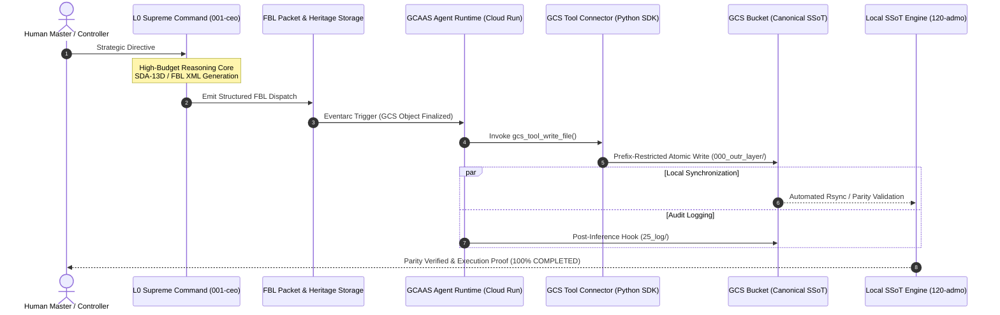

# 🌐 ArkSystem Sovereign Swarm Core (SASS v5.0)

[](https://opensource.org/licenses/Apache-2.0)
[](https://www.python.org/downloads/)
[]()
[]()

> **Sovereign Multi-Agentic AI Swarm Orchestration Engine**  
> An autonomous, deterministic, self-healing multi-agent architecture fusing corporate governance with biological homeostasis across Local, Google Drive, Google Cloud Storage (GCS), and BigQuery.

---

## 🎯 1. Why ArkSystem Sovereign Swarm? (The Why-First Paradigm)

Traditional multi-agent frameworks often suffer from three critical failure modes:
1. **Lost-in-the-Middle (LITM) Context Degradation**: Context windows saturate after multiple turns, leading to hallucination and instruction drift.
2. **Circular Feedback Deadlocks**: Uncontrolled agent-to-agent communication creates infinite messaging loops.
3. **Data Parity Drift**: Lack of deterministic synchronization between local environments and cloud data stores leads to catastrophic state divergence.

**ArkSystem solves these challenges** through **SASS v5.0 (Sovereign Agent Swarm Specification)**:
- **Acyclic Direct FBL Protocol**: Enforces acyclic Directed Acyclic Graph (DAG) communications with hard turnaround caps ($N=3$).
- **4-Tier SSoT (Single Source of Truth) Equivalence Engine**: Deterministically synchronizes state across Local Storage, Google Drive, GCS, and BigQuery.
- **Event-Driven Agent Runtime & GCS Tool Connector**: Enables secure, prefix-restricted direct cloud storage operations and zero-copy autonomous routing via Eventarc.

---

## 🏗️ 2. System Architecture & Data Flow



---

## 📦 3. Key Components

- **`src/gcs_tool_connector.py`**: Enterprise-grade Google Cloud Storage tool connector with strict IAM Condition prefix sandboxing (`000_outr_layer/`, `100_1st_layer/`) and automated conversation turn logging.
- **`src/fbl_protocol_parser.py`**: High-performance XML/YAML Feedback Loop (FBL) packet parser validating governance compliance (`LAW-FBL-RESPONSE-COMPLETION`, `LAW-TASK-BOARD-EVERY-QUERY-GOVERNANCE`).
- **`src/ssot_parity_inspector.py`**: Real-time hash and metadata parity auditor measuring Cognitive Dissociation Index (CDI) across storage tiers.

---

## 🚀 4. Quick Start

### Prerequisites
- Python 3.10+
- Google Cloud SDK (`gcloud`) authenticated with Application Default Credentials (ADC)

### Installation
```bash
git clone https://github.com/nuccoss/ArkSystem-Sovereign-Swarm-Core.git
cd ArkSystem-Sovereign-Swarm-Core
pip install -r requirements.txt
```

### Running the Multi-Agent FBL Handshake Demo
```bash
python examples/01_agent_handshake_demo.py
```

### Running Unit Tests
```bash
pytest tests/
```

---

## 🔒 5. Security & Dual Air-Gap Boundary

ArkSystem enforces strict Zero-Trust boundaries:
- **No PII Transmission**: Raw personal identity information and confidential documents are 100% air-gapped on local storage. Only SHA-256 cryptographic hashes are synchronized to the cloud.
- **Prefix Sandboxing**: GCS Tool Connectors reject any path operations outside authorized namespaces.

---

## 📜 6. License

This project is licensed under the Apache License 2.0 - see the [LICENSE](LICENSE) file for details.
